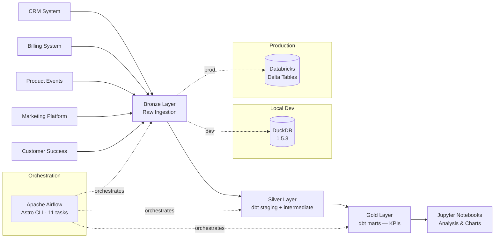

    

# SaaS Analytics Platform — CloudMetrics Inc.

End-to-end analytics pipeline for a fictional B2B SaaS company, built with
**Python · dbt · Apache Airflow · DuckDB → Databricks**

Medallion architecture (Bronze → Silver → Gold) that tracks Revenue, Retention, Growth, Product,
Customer Success, and LTV metrics across 1,000 customers and 29 months of history.
Swap one `.env` variable to move from local DuckDB to Databricks in production.

---

## Architecture



---

## Quickstart

```bash
git clone https://github.com/tu-usuario/saas-analytics-platform
cd saas-analytics-platform
bash scripts/setup.sh
```

Or step by step:

```bash
# 1. Activate the virtual environment
source "/path/to/your/ml-env/bin/activate"

# 2. Generate mock data and run Bronze ingestion
python -m src.ingestion.generate_mock_data
python -m src.ingestion.crm_ingestion
python -m src.ingestion.billing_ingestion
python -m src.ingestion.product_events_ingestion
python -m src.ingestion.marketing_ingestion
python -m src.ingestion.cs_ingestion

# 3. Run dbt Silver + Gold transformations
cd dbt
export $(grep -v '^#' ../.env | xargs)
dbt seed && dbt run && dbt test

# 4. Launch Airflow (optional — orchestrates everything above)
cd ../airflow && astro dev start
# UI → http://airflow.localhost:6563  (admin / admin)
```

---

## Project Structure

```
saas-analytics-platform/
│
├── src/                          # Python ingestion layer
│   ├── ingestion/                # One script per data source → Bronze
│   │   ├── generate_mock_data.py # Faker-based mock data (seed=42, reproducible)
│   │   ├── crm_ingestion.py      # companies + customers → bronze.*
│   │   ├── billing_ingestion.py  # subscriptions + payments → bronze.*
│   │   ├── product_events_ingestion.py
│   │   ├── marketing_ingestion.py
│   │   └── cs_ingestion.py       # nps_surveys + support_tickets → bronze.*
│   ├── quality/
│   │   └── data_quality_checks.py  # 5 checks with severity levels
│   └── utils/
│       ├── database.py           # Singleton DuckDB/Databricks connection
│       └── logger.py             # Loguru — detects Docker vs local automatically
│
├── dbt/                          # SQL transformation layer
│   ├── models/
│   │   ├── staging/              # 8 views — rename, cast, minimal cleaning
│   │   ├── intermediate/         # 3 tables — multi-source joins, business logic
│   │   └── marts/                # 7 tables — analyst-ready KPI tables
│   │       ├── finance/          # fct_mrr, fct_revenue_expansion
│   │       ├── growth/           # fct_activation_funnel, fct_customer_acquisition
│   │       └── retention/        # fct_churn, fct_cohort_retention, fct_ltv
│   ├── seeds/
│   │   └── dim_plans.csv         # Plan definitions: Starter/Pro/Business/Enterprise
│   └── profiles.yml              # env_var() — same config for DuckDB and Databricks
│
├── airflow/                      # Orchestration (Astro CLI + Docker)
│   └── dags/
│       └── dag_full_pipeline.py  # 11-task DAG: ingest → staging → intermediate → marts → test
│
├── notebooks/                    # Pre-executed analysis portfolio
│   ├── 01_bronze_ingestion.ipynb
│   ├── 02_silver_transformation.ipynb
│   ├── 03_gold_kpis.ipynb
│   ├── 04_exploratory_analysis.ipynb
│   └── build_notebook_0*.py      # nbformat build scripts
│
├── docs/                         # Architecture, KPI definitions, data sources
├── data/                         # raw/ bronze/ silver/ gold/ — gitignored
└── .env                          # DB_TYPE, DUCKDB_PATH — gitignored
```

---

## KPI Definitions

| Domain | KPI | Formula |
|--------|-----|---------|
| **Revenue** | MRR | `SUM(mrr)` — decomposed into New / Expansion / Contraction / Churned / Net New |
| **Revenue** | ARR | `MRR × 12` |
| **Revenue** | NRR | `(MRR_start + Expansion − Contraction − Churned) / MRR_start × 100` |
| **Retention** | Churn Rate | `Churned customers / Active customers at period start × 100` |
| **Retention** | Logo Churn | `Accounts cancelled / Accounts at start × 100` |
| **Retention** | Revenue Churn | `MRR cancelled / MRR at start × 100` |
| **Retention** | Cohort Retention | `Active in month N / Cohort size × 100` |
| **Growth** | Activation Rate | `Customers completing 3 steps in 14 days / New customers × 100` |
| **Growth** | Conversion Rate | `Converted leads / Total leads × 100` |
| **Growth** | CAC | `Total channel spend / Customers acquired` |
| **Product** | DAU / MAU | `DISTINCT customers with event per day / month` |
| **Product** | Stickiness | `(DAU / MAU) × calendar days` |
| **Product** | Feature Adoption | `MAU using feature / Total MAU × 100` |
| **Customer Success** | NPS | `%Promoters − %Detractors` (range: −100 to +100) |
| **Customer Success** | Health Score | `NPS×0.30 + Engagement×0.30 + Payments×0.25 + Tickets×0.15` |
| **Customer Success** | TTR | `AVG(resolved_at − created_at)` by priority |
| **LTV** | LTV / CAC | `LTV / CAC` — benchmark: > 3× healthy, > 5× excellent |

**Benchmarks (real data from this pipeline):**
MRR `$25,551` · ARR `$306,612` · Cohort M12 avg `91.5%` · Activation Rate `67%` · NRR `> 100%`

---

## Tech Stack

| Tool | Role | Version |
|------|------|---------|
| Python | Data ingestion, mock data generation, orchestration scripts | 3.12 |
| DuckDB | Local OLAP database — same SQL dialect as Databricks | 1.5.3 |
| dbt-duckdb | SQL transformations with tests, lineage, and documentation | 1.9.4 |
| Apache Airflow | DAG-based pipeline orchestration | 2.x (Astro runtime 3.2) |
| Astro CLI | Local Airflow via Docker — replicates production exactly | latest |
| Docker | Airflow worker containers (scheduler + dag-processor + triggerer) | — |
| Faker | Reproducible mock data generation (seed=42) | — |
| Loguru | Structured logging — detects Docker vs local automatically | — |
| Plotly | Interactive dark-theme charts in Jupyter notebooks | 5.x |
| Databricks | Production target — swap `.env` to migrate from DuckDB | Coming soon |

---

## Notebooks

Pre-executed with real DuckDB outputs — no need to run anything.

| Notebook | What it shows | Key outputs |
|----------|--------------|-------------|
| [01 — Bronze Ingestion](notebooks/01_bronze_ingestion.ipynb) | Python ingestion pipeline, data quality checks, Bronze schema | 8 tables · 81,842 rows · 100% quality score |
| [02 — Silver Transformation](notebooks/02_silver_transformation.ipynb) | dbt staging + intermediate, SQL models, Bronze→Silver comparison | 11 models · 33 dbt tests passing |
| [03 — Gold KPIs](notebooks/03_gold_kpis.ipynb) | 7 mart models, MRR waterfall, cohort heatmap, LTV/CAC analysis | 18 charts · MRR $25,551 · ARR $306,612 |
| [04 — Exploratory Analysis](notebooks/04_exploratory_analysis.ipynb) | 5 business questions, Airflow pipeline section, team takeaways | 7 charts · channel ROI · churn timing · NPS |

---

## Data Pipeline

```
5 data sources
    │
    ▼  Python ingestion (src/ingestion/)
8 Bronze tables — 81,842 rows — 100% quality score
    │
    ▼  dbt run --select staging
8 Silver views  — type casting, renaming, deduplication
    │
    ▼  dbt run --select intermediate
3 Silver tables — multi-source joins, business logic
    │
    ▼  dbt run --select marts
7 Gold tables   — analyst-ready KPIs
    │
    ▼  dbt test
54 tests passing (25 staging + 8 intermediate + 21 marts)
    │
    ▼  Full pipeline via Airflow DAG
11 tasks — runs in < 5 minutes
```

**Airflow DAG tasks:**
`ingest_crm` → `ingest_billing` → `ingest_product_events` → `ingest_marketing` → `ingest_cs`
→ `dbt_staging` → `dbt_intermediate` → `dbt_marts` → `dbt_test` → `pipeline_complete`

> Tasks run sequentially during ingestion because DuckDB enforces a single-writer lock.
> On Databricks, ingestion tasks can run in parallel.

---

## Development vs Production

| Config | Development | Production |
|--------|-------------|------------|
| Database | DuckDB 1.5.3 (local file) | Databricks (Delta Tables) |
| dbt target | `dev` | `prod` |
| Orchestration | Astro CLI + Docker local | Astronomer (managed Airflow) |
| Data | Mock data — Faker (seed=42) | Real customer data |
| Change needed | `DB_TYPE=duckdb` in `.env` | `DB_TYPE=databricks` in `.env` |
| Code changes | None | None — same Python + SQL |

The `profiles.yml` uses `env_var()` with a Docker-compatible fallback so the same dbt project
runs identically in local development, Docker-based Airflow, and Databricks production.

---

## Contributing

Pull requests are welcome. For major changes, open an issue first to discuss what you would like to change.

1. Fork the repository
2. Create a feature branch (`git checkout -b feature/my-feature`)
3. Commit your changes (`git commit -m 'feat: add my feature'`)
4. Push to the branch (`git push origin feature/my-feature`)
5. Open a Pull Request

---

## License

[MIT](https://choosealicense.com/licenses/mit/)
