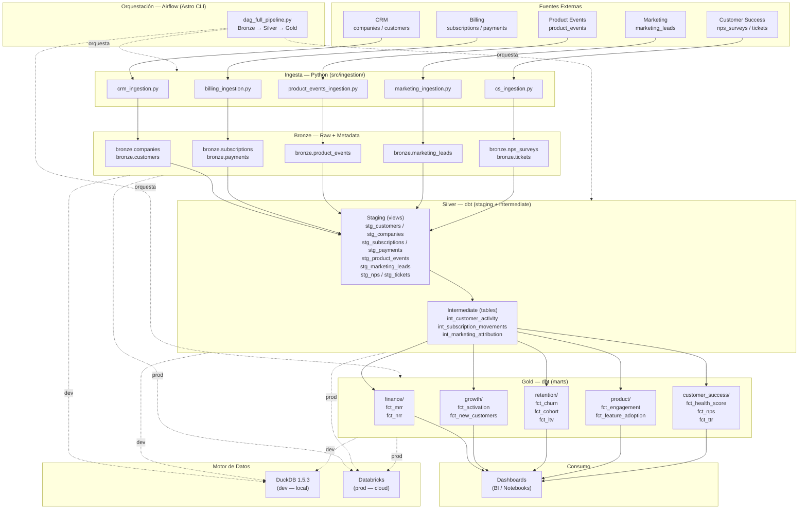

# Architecture — CloudMetrics Inc.

Pipeline de datos batch con arquitectura Medallion (Bronze → Silver → Gold).
Airflow orquesta todas las capas; DuckDB en desarrollo, Databricks en producción.

---

## Diagrama de arquitectura



---

## Capas de datos

### Bronze — Raw + Metadata

- **Qué contiene:** datos crudos tal como llegan de la fuente, sin transformar
- **Cómo se pobla:** scripts Python en `src/ingestion/`
- **Formato:** tablas DuckDB con columnas de metadata añadidas:
  - `_ingested_at` — timestamp de ingesta
  - `_source` — nombre de la fuente de origen
- **Política:** append-only, nunca se modifica un registro Bronze

### Silver — Limpio + Tipado

- **Qué contiene:** datos normalizados, con tipos correctos, deduplicados y validados
- **Cómo se pobla:** modelos dbt en `dbt/models/staging/` y `dbt/models/intermediate/`
- **Staging:** views sobre Bronze, renombrado de columnas y casting de tipos
- **Intermediate:** tablas con joins multi-fuente y lógica de negocio

### Gold — KPIs

- **Qué contiene:** métricas de negocio calculadas, listas para consumo
- **Cómo se pobla:** modelos dbt en `dbt/models/marts/`
- **Organización:** un subdirectorio por dominio de KPI
- **Consumidores:** dashboards BI, notebooks de análisis, alertas automáticas

---

## Orquestación

Airflow gestiona la ejecución del pipeline completo de forma diaria.

```
dag_full_pipeline.py
│
├── Task Group: bronze_ingestion
│   ├── ingest_crm
│   ├── ingest_billing
│   ├── ingest_product_events
│   ├── ingest_marketing
│   └── ingest_customer_success
│
├── Task Group: silver_transformation
│   ├── dbt_staging
│   └── dbt_intermediate
│
└── Task Group: gold_kpis
    ├── dbt_marts_finance
    ├── dbt_marts_growth
    ├── dbt_marts_retention
    ├── dbt_marts_product
    └── dbt_marts_customer_success
```

- **Scheduler:** daily @ 02:00 UTC
- **UI:** http://localhost:8080 (dev)
- **Runtime:** `astrocrpublic.azurecr.io/runtime:3.2-4`

---

## Entornos

| Aspecto | Dev | Prod |
|---|---|---|
| Motor SQL | DuckDB 1.5.3 (local) | Databricks (cloud) |
| dbt target | `dev` | `prod` |
| Airflow | Astro CLI + Docker local | Managed Airflow (cloud) |
| Config | `.env` con `DUCKDB_PATH` | Variables de entorno cloud |
| Datos | Mock generados con Faker | Datos reales de clientes |

> El swap Dev → Prod es solo un cambio de `profiles.yml` en dbt y variables de entorno — el código Python y SQL no cambia.

---

## Data Quality

Los checks de calidad se ejecutan después de Bronze y antes de Silver:

- **Python:** `src/quality/data_quality_checks.py` — checks sobre Bronze
- **dbt tests:** `not_null`, `unique`, `accepted_values`, `relationships` sobre Silver
- **Reporte:** `src/quality/quality_report.py` — resumen de resultados por ejecución
